```mermaid
flowchart LR
    A[AI Response] --> B[JSON Parse Attempt]
    B -->|Valid| F[Return Output ✅]
    B -->|Invalid| C[Auto-Fix Hook 🔧]
    C --> D[Revalidate Schema]
    D -->|Fixed| F
    D -->|Still Invalid| E[Retry or Fallback 🚨]
    E --> G[Raise AiGuardrails::SchemaError]
```

# AiGuardrails

[](https://rubygems.org/gems/ai_guardrails)
[](https://github.com/logicbunchhq/ai_guardrails/actions)
[](https://coveralls.io/github/logicbunchhq/ai_guardrails?branch=main)

> **AiGuardrails** is a Ruby gem for validating, repairing, and securing AI-generated outputs.
> It ensures responses from LLMs (like OpenAI or Anthropic) are **valid, safe, and structured**.

---

## Table of Contents

1. [Overview](#overview)
2. [Installation](#installation)
3. [Quick Start](#quick-start)
4. [Features](#features)

   * [Schema Validation](#schema-validation)
   * [Automatic JSON Repair](#automatic-json-repair)
   * [Unit Test Helpers / Mock Model Client](#unit-test-helpers--mock-model-client)
   * [Provider-Agnostic API](#provider-agnostic-api)
   * [Auto-Correction / Retry Layer](#auto-correction--retry-layer)
   * [Safety & Content Filters](#safety--content-filters)
   * [Easy DSL / Developer-Friendly API](#easy-dsl--developer-friendly-api)
   * [Background Job / CLI Friendly](#background-job--cli-friendly)
   * [Optional Caching](#optional-caching)
   * [JSON + Schema Auto-Fix Hooks](#json--schema-auto-fix-hooks)
5. [Error Handling](#error-handling)
6. [Development](#development)
7. [Contributing](#contributing)
8. [License](#license)
9. [Code of Conduct](#code-of-conduct)

---

## Overview

AI models often generate invalid JSON, inconsistent data types, or unsafe content.
**AiGuardrails** helps you handle all of this automatically, providing:

* ✅ JSON repair for malformed AI responses
* ✅ Schema validation for predictable structure
* ✅ Safety filters for blocked or harmful content
* ✅ Retry + correction for invalid responses
* ✅ Easy integration via a single `AiGuardrails.run` call

---



---

## Installation

Add AiGuardrails to your project using Bundler:

```bash
bundle add ai_guardrails
```

Or install manually:

```bash
gem install ai_guardrails
```

---

## Requirements

- Ruby >= 3.0.0
- Rails >= 6.0 (if using Rails integration)
- Optional dependencies:
  - `ruby-openai` for OpenAI provider
  - `ruby-anthropic` gem if using Anthropic provider

---

## Quick Start

```ruby
require "ai_guardrails"

schema = { name: :string, price: :float }

# Optional: Helps AI return structured output matching the schema.
# Can be any type: String, Hash, etc.
schema_hint = schema

result = AiGuardrails::DSL.run(
  prompt: "Generate a product JSON",
  provider: :openai,
  provider_config: { api_key: ENV["OPENAI_API_KEY"] },
  schema: schema,
  schema_hint: schema_hint
)

puts result
# => { "name" => "Laptop", "price" => 1200.0 }
```

---

## Features

### Schema Validation

Validate AI output against a Ruby schema.

```ruby
require "ai_guardrails"

schema = { name: :string, price: :float, tags: [:string] }
validator = AiGuardrails::SchemaValidator.new(schema)

input = { name: "Laptop", price: 1200.0, tags: ["electronics", "sale"] }
success, result = validator.validate(input)

if success
  puts "Valid output: #{result}"
else
  puts "Validation errors: #{result}"
end
```

#### Supported Types

| Type                 | Example                |
| -------------------- | ---------------------- |
| `:string`            | `"Laptop"`             |
| `:integer`           | `42`                   |
| `:float`             | `19.99`                |
| `:boolean`           | `true`                 |
| `[:string]`          | `["a", "b"]`           |
| `[{ key: :string }]` | `[{"key" => "value"}]` |

#### Example Invalid Input

```ruby
input = { name: 123, price: "abc", tags: ["electronics", 2] }
success, errors = validator.validate(input)
# => { name: ["must be a string"], price: ["must be a float"], tags: ["element 1 must be a string"] }
```

---

### Automatic JSON Repair

LLMs often return invalid JSON.
`AiGuardrails::JsonRepair` automatically fixes common issues.

```ruby
require "ai_guardrails"

raw_json = "{name: 'Laptop' price: 1200, tags: ['electronics' 'sale']}"
fixed = AiGuardrails::JsonRepair.repair(raw_json)

puts fixed
# => { "name" => "Laptop", "price" => 1200, "tags" => ["electronics", "sale"] }
```

**What It Fixes**

* Missing quotes or commas
* Single → double quotes
* Trailing commas
* Unbalanced braces/brackets
* Nested arrays/objects without separators

**Unrepairable JSON Example**

```ruby
begin
  AiGuardrails::JsonRepair.repair("NOT JSON")
rescue AiGuardrails::JsonRepair::RepairError => e
  puts "Could not repair JSON: #{e.message}"
end
```

**Integration with Schema Validation**

```ruby
schema = { name: :string, price: :float }
fixed = AiGuardrails::JsonRepair.repair("{name: 'Laptop', price: '1200'}")
validator = AiGuardrails::SchemaValidator.new(schema)
success, result = validator.validate(fixed)
```

---

### Unit Test Helpers / Mock Model Client

Simulate AI model responses for testing without API calls.

```ruby
mock_client = AiGuardrails::MockModelClient.new(
  "Generate product" => '{"name": "Laptop", "price": 1200}'
)

response = mock_client.call(prompt: "Generate product")
puts response
# => '{"name": "Laptop", "price": 1200}'

mock_client.add_response("Generate user", '{"name": "Alice"}')
```

**Simulate API Errors**

```ruby
begin
  mock_client.call(prompt: "error", raise_error: true)
rescue AiGuardrails::MockModelClient::MockError => e
  puts e.message
end
```

**Fallback Example**

```ruby
response = mock_client.call(prompt: "error", default_fallback: "No mock response defined")
puts response
# => "No mock response defined"
```

---

### Provider-Agnostic API

AiGuardrails supports **any LLM provider**, with dynamic loading and zero vendor dependencies.

| Provider       | Gem              | Status      |
| -------------- | ---------------- | ----------- |
| OpenAI         | `ruby-openai`    | ✅ Supported |
| Anthropic      | `ruby-anthropic` | 🔜 Planned  |
| Google Gemini  | `gemini-ai`      | 🔜 Planned  |
| Ollama (local) | `ollama-ai`      | 🔜 Planned  |

```ruby
client = AiGuardrails::Provider::Factory.build(
  provider: :openai,
  config: { api_key: ENV["OPENAI_API_KEY"], model: "gpt-4o-mini" }
)

puts client.call_model(prompt: "Hello!")
```

---

### Auto-Correction / Retry Layer

Automatically repairs and retries AI output until it passes schema validation.

```ruby
schema = { name: :string, price: :float }

client = AiGuardrails::Provider::Factory.build(
  provider: :openai,
  config: { api_key: ENV["OPENAI_API_KEY"] }
)

auto = AiGuardrails::AutoCorrection.new(provider: client, schema: schema, max_retries: 3, sleep_time: 1)

result = auto.call(prompt: "Generate a product JSON", schema_hint: schema)
puts result
# => { "name" => "Laptop", "price" => 1200.0 }
```

**Optional Parameters**

* `max_retries`: Maximum retry attempts
* `sleep_time`: Delay between retries
* `schema_hint`: Optional guide to help AI produce valid output
* Raises `AiGuardrails::AutoCorrection::RetryLimitReached` if retries exhausted

---

### Safety & Content Filters

Detect and block unsafe or prohibited content.

```ruby
filter = AiGuardrails::SafetyFilter.new(blocklist: ["badword", /forbidden/i])

filter.safe?("clean text") # => true
filter.safe?("badword inside") # => false
```

Raise exception on violation:

```ruby
begin
  filter.check!("This has badword")
rescue AiGuardrails::SafetyFilter::UnsafeContentError => e
  puts e.message
end
```

---

### Easy DSL / Developer-Friendly API

`AiGuardrails::DSL.run` is a single entry point combining:

* JSON repair
* Schema validation
* Auto-correction & retries
* Safety filters
* Logging & debugging
* Optional caching

```ruby
result = AiGuardrails::DSL.run(
  prompt: "Generate product",
  schema: { name: :string, price: :float },
  schema_hint: schema, # It could be any other data type eg, string, json etc
  provider: :openai,
  provider_config: { api_key: ENV["OPENAI_API_KEY"] },
  blocklist: ["Forbidden"]
)

puts result
# => { "name" => "Laptop", "price" => 1200.0 }
```

**Schema vs Schema Hint**

* `schema` (required): Full validation for final output.
* `schema_hint` (optional): Guides AI generation, can be a subset or modified version.

```ruby
schema = { name: :string, price: :float, tags: [:string] }
hint = "JSON should contain name, price and tags"

result = AiGuardrails::DSL.run(
  prompt: "Generate product JSON",
  schema: schema,
  schema_hint: hint,
  provider_config: { api_key: ENV["OPENAI_API_KEY"] },
  blocklist: ["Forbidden"],
  max_retries: 3,
  sleep_time: 1
)

puts result
# => { "name" => "Laptop", "price" => 1200.0, "tags" => ["electronics", "sale"] }
```

---

### Background Job / CLI Friendly

Works seamlessly in Rails background jobs, Sidekiq, or standalone CLI scripts.

**Background Job Example**

```ruby
require "logger"

logger = Logger.new($stdout)

AiGuardrails::BackgroundJob.perform(logger: logger, debug: true) do
  AiGuardrails::DSL.run(
    prompt: "Generate product",
    schema: { name: :string, price: :float },
    schema_hint: { name: :string, price: :float },
    provider_config: { api_key: ENV["OPENAI_API_KEY"] }
  )
end
```

**CLI Example (Standalone Script or IRB)**
Use the CLI for running workflows outside of Rails or for local testing.

```ruby
# If running as a standalone Ruby script, make sure the gem lib path is loaded:
$LOAD_PATH.unshift(File.expand_path("lib", __dir__))
require "ai_guardrails"

AiGuardrails::CLI.run(debug: true) do
  result = AiGuardrails::DSL.run(
    prompt: "Generate product",
    schema: { name: :string, value: :integer },
    schema_hint: { name: :string, value: :integer },
    provider_config: { api_key: ENV["OPENAI_API_KEY"] }
  )

  puts result
end

```
---

**Note**: End-users of the gem in Rails projects do not need the CLI. It is primarily for gem developers or for running workflows outside a Rails app.

### Optional Caching

Cache AI responses for repeated prompts to reduce cost and latency.

```ruby
AiGuardrails::Cache.configure(enabled: true, store: Rails.cache, expires_in: 300)

schema = { name: :string, price: :float }

result1 = AiGuardrails::DSL.run(prompt: "Generate product", schema: schema, schema_hint: schema, provider_config: { api_key: ENV["OPENAI_API_KEY"] })
result2 = AiGuardrails::DSL.run(prompt: "Generate product", schema: schema, schema_hint: schema, provider_config: { api_key: ENV["OPENAI_API_KEY"] })

puts result1 == result2 # => true
```

**Fetch Examples**

```ruby
key = AiGuardrails::Cache.key("prompt", schema)

# Using default
value = AiGuardrails::Cache.fetch(key, "default_value")

# Using block
value = AiGuardrails::Cache.fetch(key) { "computed_result" }
```

---

### JSON + Schema Auto-Fix Hooks

Automatically repair and coerce malformed JSON to match schema.

```ruby
schema = { name: :string, price: :float, available: :boolean }
raw = '{"name": "Shirt", "price": "19.99", "available": "true"}'

fixed = AiGuardrails::AutoFix.fix(raw, schema: schema)
# => {"name"=>"Shirt", "price"=>19.99, "available"=>true}
```

**Custom Hooks**

```ruby
hooks = [proc { |h| h["price"] *= 2 }]
fixed = AiGuardrails::AutoFix.fix(raw, schema: schema, hooks: hooks)
puts fixed["price"] # => 39.98
```

Hooks allow:

* Setting **default values**
* Transforming or normalizing data
* Custom calculations or aggregations
* Injecting metadata before final output

Hooks run after schema validation and JSON repair, ensuring safe, valid, and tailored output.

---

## Error Handling

| Exception                                         | When It Occurs                                  |
| ------------------------------------------------- | ----------------------------------------------- |
| `AiGuardrails::JsonRepair::RepairError`           | Cannot repair invalid JSON input                |
| `AiGuardrails::AutoCorrection::RetryLimitReached` | Maximum retries reached without valid output    |
| `AiGuardrails::SafetyFilter::UnsafeContentError`  | Blocked or unsafe content detected in AI output |

Example:

```ruby
begin
  result = AiGuardrails::DSL.run(prompt: "Generate product", schema: schema)
rescue AiGuardrails::AutoCorrection::RetryLimitReached => e
  puts "Retries exceeded: #{e.message}"
rescue AiGuardrails::SafetyFilter::UnsafeContentError => e
  puts "Blocked content detected: #{e.message}"
end
```

---

## Development

Install dependencies:

```bash
bin/setup
rake spec
```

Interactive console:

```bash
bin/console
```

Release a new version:

```bash
bundle exec rake release
```

---

## Contributing

Bug reports and pull requests are welcome at:
👉 [https://github.com/logicbunchhq/ai_guardrails](https://github.com/logicbunchhq/ai_guardrails)

This project follows the [Contributor Covenant](https://www.contributor-covenant.org/).

---

## License

Released under the [MIT License](https://opensource.org/licenses/MIT).

---

## Code of Conduct

Everyone interacting with AiGuardrails project is expected to follow the
[Code of Conduct](https://github.com/logicbunchhq/ai_guardrails/blob/master/CODE_OF_CONDUCT.md).
